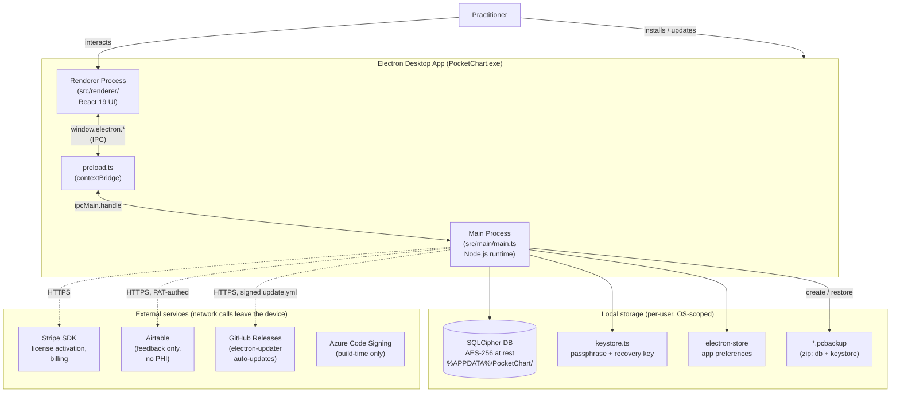
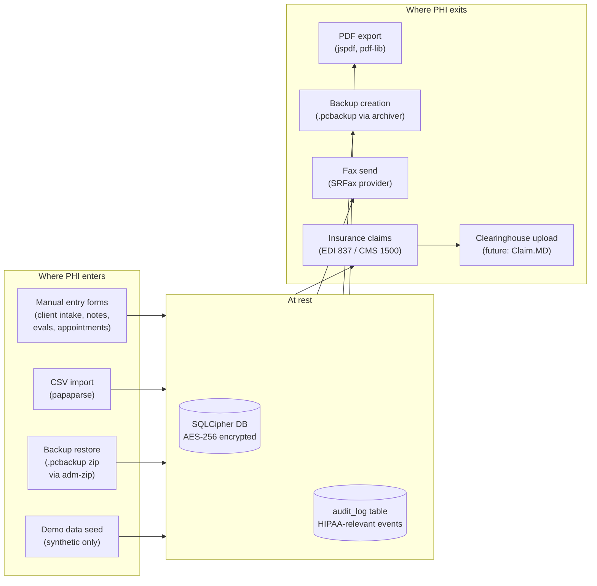
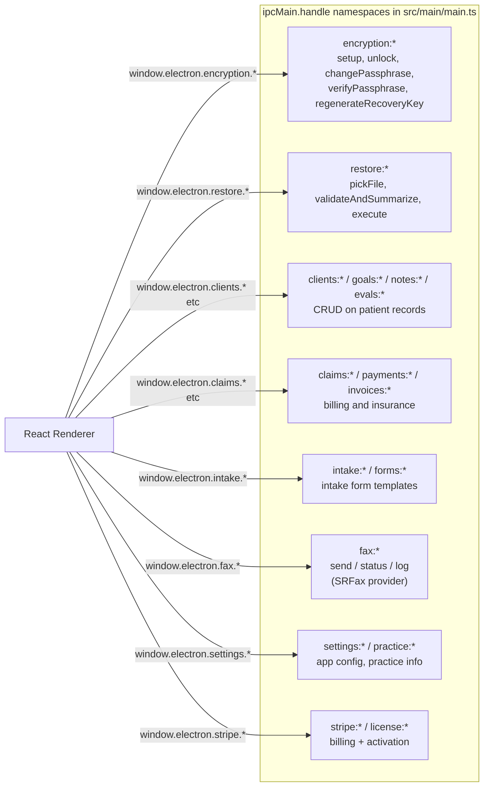
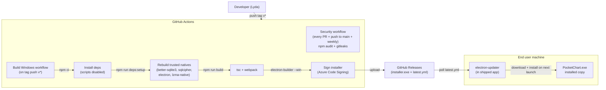
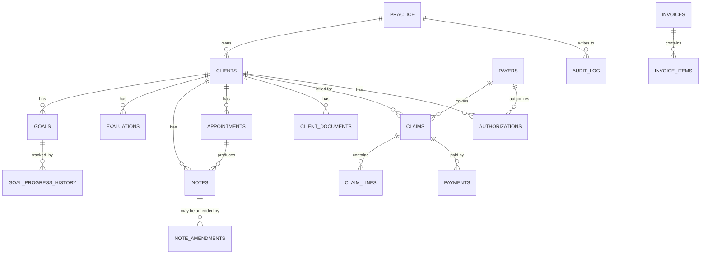

# PocketChart - Architecture (visual reference)

**Purpose.** Quick-load semantic map of the system, optimized for both human
skimming and AI assistants reading the codebase. Update when major
boundaries change. If a diagram drifts from reality, fix the diagram —
not by deleting it, by editing it.

Mermaid renders natively in GitHub, Obsidian, and most modern markdown
viewers. VS Code needs the "Markdown Preview Mermaid Support" extension.

---

## 1. System architecture (high level)

**Key invariants the diagram captures:**
- Renderer never touches the DB directly. All PHI access goes Main → DB.
- The DB file is encrypted at rest via SQLCipher; the passphrase lives in
  `keystore.ts` (encrypted with the user's master passphrase).
- The only outbound network paths are Stripe, Airtable feedback, and GitHub
  Releases auto-update. Anything else routing PHI off-device would be a
  significant architectural change.
- Azure code signing happens in CI, not at runtime — included for completeness.

---

## 2. PHI data flow (the security-relevant view)

**Why this diagram matters:**
- Every arrow into or out of `Core` is a place where PHI crosses a boundary.
- The dependencies pinned in [SECURITY.md](../SECURITY.md) (papaparse, jspdf,
  pdf-lib, archiver, adm-zip) are pinned because they sit on these arrows.
- Claim.MD integration (planned) extends `Clearinghouse` — when added, its
  SDK should also get pinned and listed in SECURITY.md.

---

## 3. IPC channels (renderer ↔ main contract)

The renderer never executes Node.js APIs directly — all privileged operations
go through IPC channels exposed via `preload.ts`. Channels are namespaced
by feature.

**Conventions:**
- All channel names are `namespace:operation` (lower-camelCase operation).
- Handlers in `main.ts` are grouped by namespace; if you add a channel,
  put it next to its siblings.
- `contextIsolation: true` is on (see `createWindow()` in main.ts) — never
  disable it without serious thought; it's a load-bearing security boundary.

---

## 4. Build & release pipeline

**Notes:**
- `Security` workflow ([.github/workflows/security.yml](../.github/workflows/security.yml))
  runs on every PR; blocks merge on high+ npm audit findings or any gitleaks hit.
- `Build Windows` ([.github/workflows/build-windows.yml](../.github/workflows/build-windows.yml))
  only runs on `v*` tag pushes (or manual `workflow_dispatch`) — does not run
  on every PR.
- The installer is Azure-signed; tampering with the signed binary would
  break signature verification on user machines.
- `electron-updater` verifies `latest.yml` signatures against the publisher
  before applying updates — this is the auto-update channel and a top-tier
  compromise vector (see [SECURITY.md](../SECURITY.md) pinned-deps rationale).

---

## 5. Domain model (high level)

The DB has 50+ tables; this shows the load-bearing relationships.

**V4 multi-tenancy.** Per the 2026-04-30 commit `54ec2f4`, 33 core tables
gained `practice_id` and `created_by_user_id` columns. The current single-
practice model treats `practice_id` as a constant; future cloud-multi-tenant
deployments will use it for row-level scoping. **At that point, true
row-level security (Postgres RLS) becomes architecturally relevant.** Until
then, security is enforced at the OS file-permission and SQLCipher
encryption layers.

---

## How to extend this doc

- **New external service?** Add a node + arrow to diagram §1 and (if it
  touches PHI) to §2. Pin the SDK in package.json and document in
  SECURITY.md.
- **New IPC namespace?** Add a node to diagram §3.
- **New build step?** Edit diagram §4.
- **New table?** If load-bearing, add to diagram §5; if niche, leave it
  to the schema.

When in doubt: **draw it as text first, render later.** Mermaid syntax
is grep-able and AI-readable even when nothing's rendering it.
